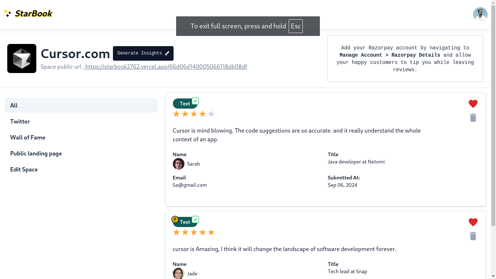

# StarBook

Collecting testimonials is tough, StarBook is all-In-One solution for collecting testimonials and you can embed the testimonials directly on your website.

Tech Stack- Reactjs, Redux, Clerk(for auth), Iframe-Resizer, Expressjs,MongoDB,Cloudinary,Razorpay API

## Add this Code to a replit template website(or check our live demo)

```
<iframe id="starbook-66cc1fc4e29b3e5fff22d1a9" src="https://starbook2762.vercel.app/embed/66d06d140005066118db08df?dark=false" frameborder="0" scrolling="no" width="100%"></iframe>
<script src="https://cdn.jsdelivr.net/npm/@iframe-resizer/parent"></script>
<script>
  iframeResize({
    license: "GPLv3",
    log: true,
    checkOrigin: false,
  }, '#starbook-66cc1fc4e29b3e5fff22d1a9');
</script>
```

<a href="https://codepen.io/Wasif-Kareem/pen/OJeExjy?editors=1000"
rel="noopener noreferrer"
target="_blank">

</a>

## How it works?

Check out the 3-minute demo video below.
[](https://www.youtube.com/watch?v=gaiyO3RZB6E)
